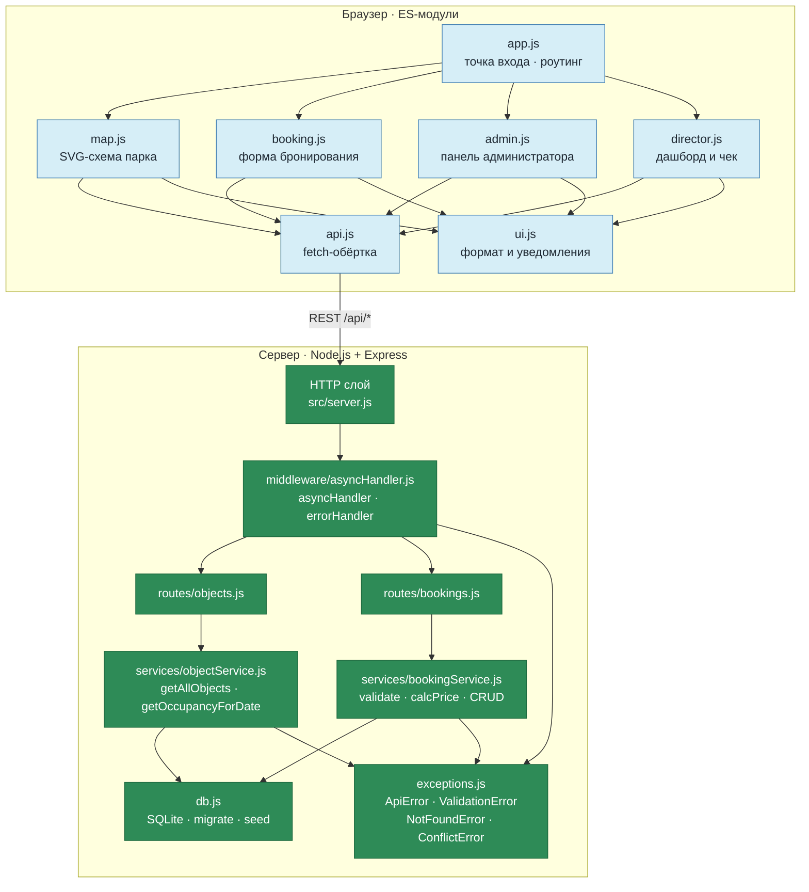

# Компонентная диаграмма (Mermaid)

Диаграмма описывает связь модулей интегрированного приложения «Старый Бердск».
Отрисовывается в GitHub, VS Code (плагин Mermaid) или на mermaid.live.



## Связи между модулями

Связи реализованы подписками, а не прямыми импортами: ни один экранный модуль
не знает о существовании остальных. `app.js` выступает шиной событий.

| Источник | Событие | Подписчик | Действие |
|----------|---------|-----------|----------|
| `map.js` | `onSelect(object)` | `app.js` | Открывает карточку объекта в `booking.js` |
| `map.js` | `onBusyChange(objects)` | `app.js` | Складывает актуальные объекты в состояние приложения |
| `booking.js` | `onBookingCreated(booking)` | `app.js` | Перезагружает карту, чтобы занятый слот стал красным |
| `admin.js` | `onBookingsChanged()` | `app.js` | Обновляет карту после смены статуса или отмены |

## Слои и правило зависимостей

Зависимости направлены строго внутрь. Обратных связей нет.

```
app.js  ->  map / booking / admin / director  ->  api.js  ->  HTTP
                                                          |
routes -> services -> db.js + exceptions.js  <------------+
```

- `routes` не знает про `services` деталей реализации, только про их имена.
- `services` не знают про Express и `req`/`res`.
- `exceptions.js` не зависит ни от чего, кроме встроенного `Error`.
- Фронтенд не импортирует серверные модули: граница проходит по REST API.

## Точки, где менялась схема

Дни 4–7: серверная часть выросла из трёх модулей (`db`, `bookingService`,
`routes`) до полного слоя REST API с типизированными исключениями. Появились
`middleware/asyncHandler.js` и `exceptions.js`, отделённые от бизнес-логики.
Фронтенд вынесен в `src/public/` и общается с сервером только через `api.js`.
