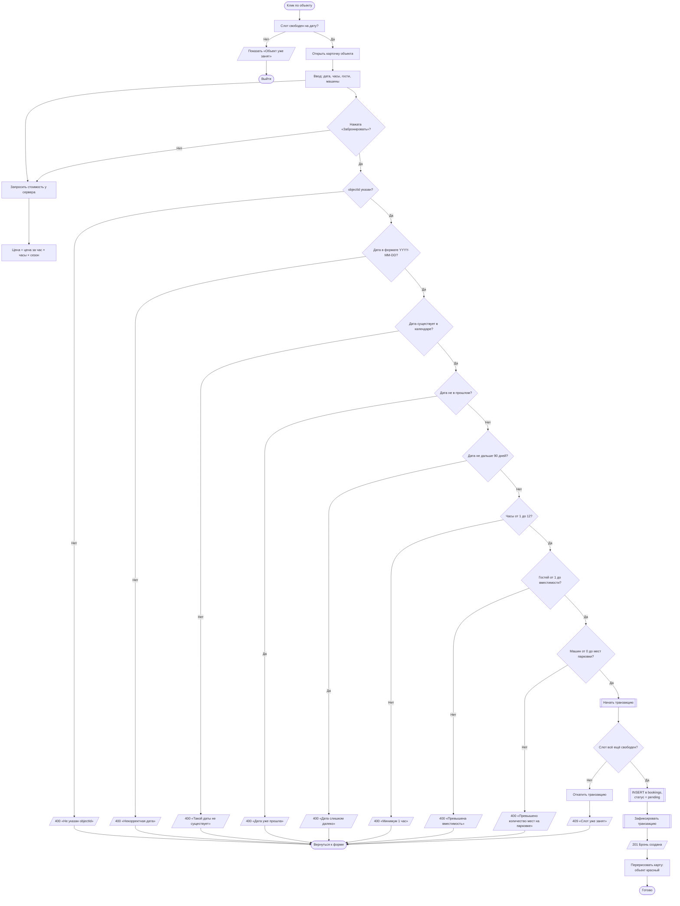
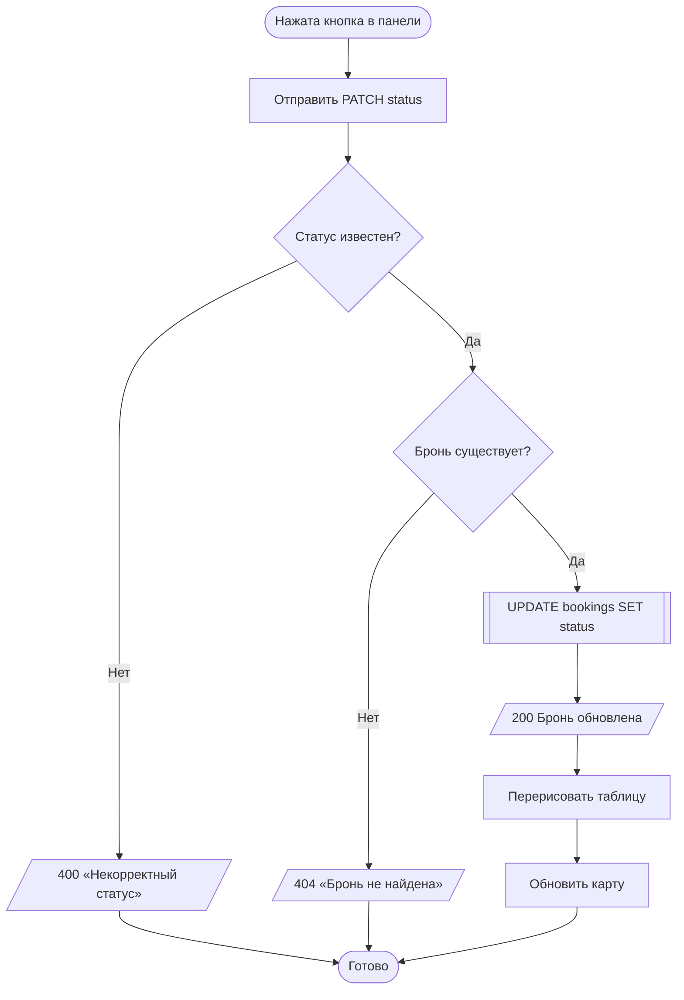
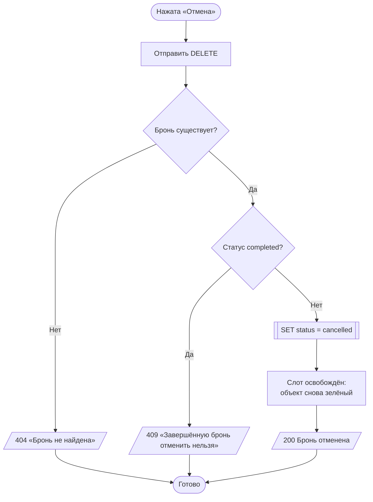
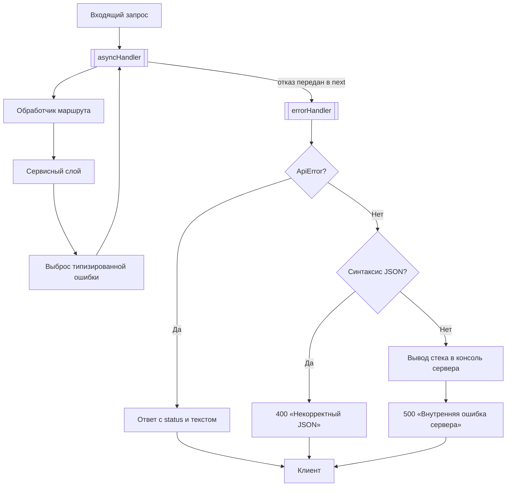

# Диаграмма деятельности (Activity Diagram)

**Дата:** 2026-10-09
**Проект:** «Старый Бердск»
**Версия диаграммы:** 1.1 — добавлены ветвления обработки ошибок

Три диаграммы: создание брони, смена статуса администратором, отмена брони.

## 1. Создание брони

### Почему проверка слота внутри транзакции

Проверка занятости и вставка идут одним блоком. Без этого два быстрых клика
по кнопке могли бы создать две брони на один слот: обе проверки видели бы
свободный слот и обе записали бы строку. Транзакция в better-sqlite3
выполняется атомарно, поэтому выигрывает только один.

## 2. Смена статуса администратором

Допустимые переходы заданы таблицей `TRANSITIONS` в `src/public/admin.js`.
Уже завершённую бронь нельзя ни подтвердить, ни активировать.

## 3. Отмена брони

### Отмена не удаляет запись

Бронь помечается как отменённая, а не удаляется из базы. Причина — история
операций нужна директору для сверки выручки: физическое удаление строки
сотрло бы след операции. При этом отменённая бронь не занимает слот, потому
что подсчёт занятости исключает статус `cancelled`.

## Обработка ошибок на уровне сервера

Наружу отдаётся только текст для пользователя. Стек исключения показывается
в консоли сервера, чтобы не раскрывать внутренности в ответе.