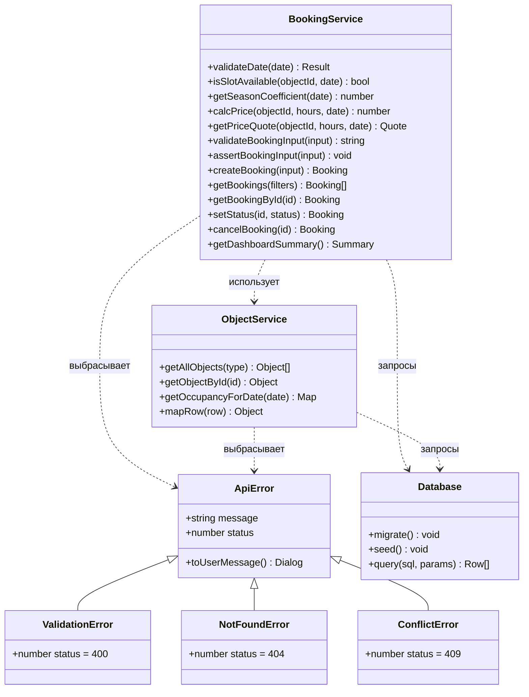
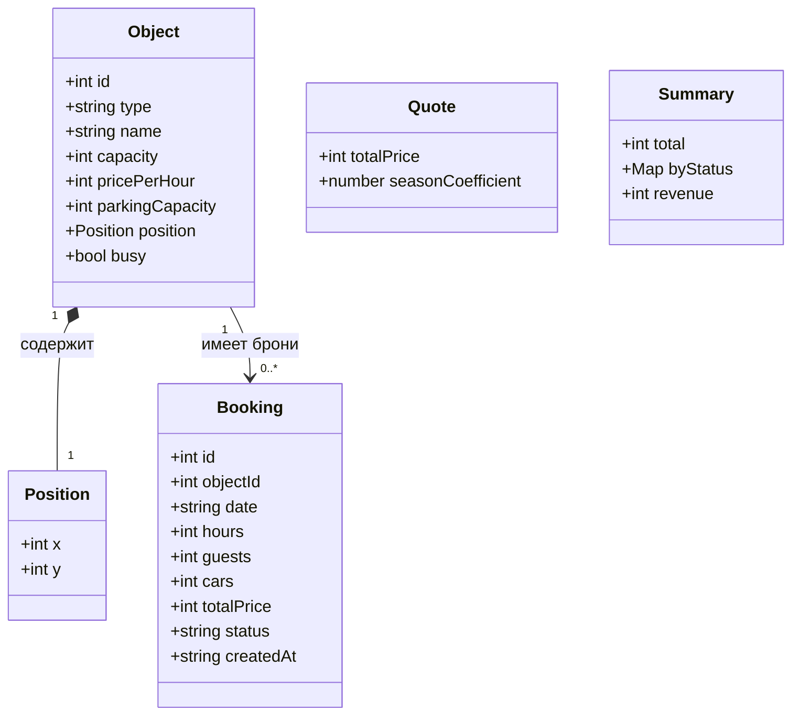
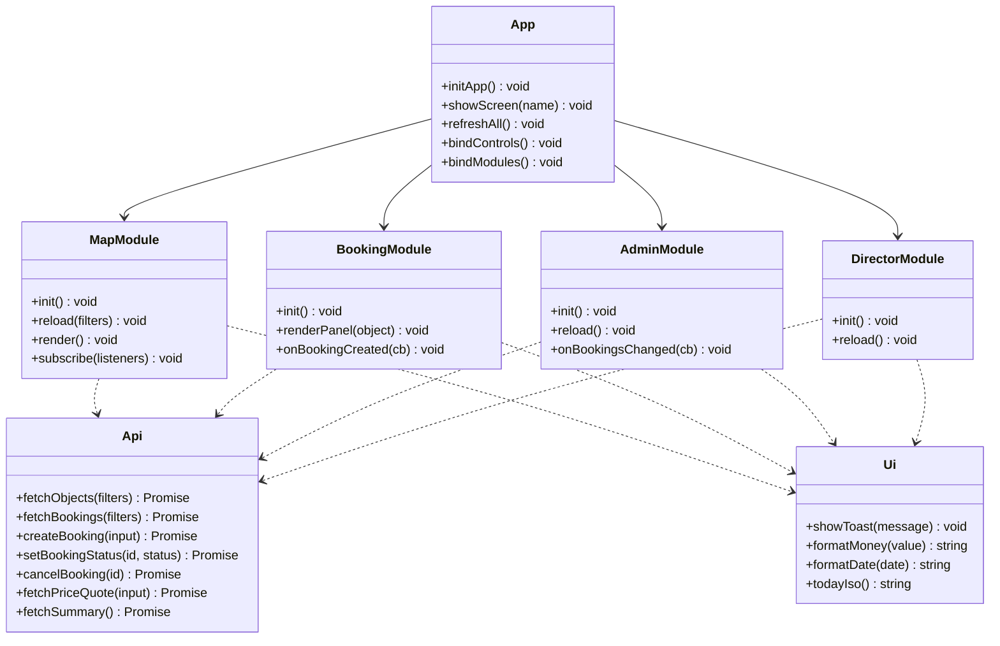

# Диаграмма классов (Class Diagram)

**Дата:** 2026-10-09
**Проект:** «Старый Бердск»
**Версия диаграммы:** 1.1

Диаграмма отражает реальную структуру кода: слева — серверный слой,
справа — модули фронтенда. Имена классов и методов совпадают с исходниками.

## Серверный слой

## Модель данных

## Фронтенд

## Ключевые решения

| Решение | Обоснование |
|---------|-------------|
| `BookingService` и `ObjectService` — набор функций, а не классы | Бизнес-логика не хранит состояние, экземпляры не нужны. Модуль проще тестировать и подменять |
| `exceptions.js` отдельно от сервисов | Иерархия ошибок используется и сервером, и браузером; вынесение убрало бы циклическую зависимость |
| `bookingStatus.js` отдельно | Чтобы `objectService` ссылался на `CANCELLED`, не импортируя весь `bookingService` |
| Модули фронтенда связаны подписками, а не наследованием | Экраны независимы: панель администратора не должна знать о карте |
| `Api` и `Ui` — единственные точки выхода наружу | Смена транспорта или оформления уведомлений затрагивает один файл |

## Соответствие коду

| Класс на диаграмме | Файл |
|---|---|
| `BookingService` | `src/services/bookingService.js` |
| `ObjectService` | `src/services/objectService.js` |
| `ApiError` и наследники | `src/exceptions.js` |
| `Database` | `src/db.js` |
| `MapModule`, `BookingModule`, `AdminModule`, `DirectorModule` | `src/public/*.js` |
| `Api` | `src/public/api.js` |
| `Ui` | `src/public/ui.js` |
| `App` | `src/public/app.js` |