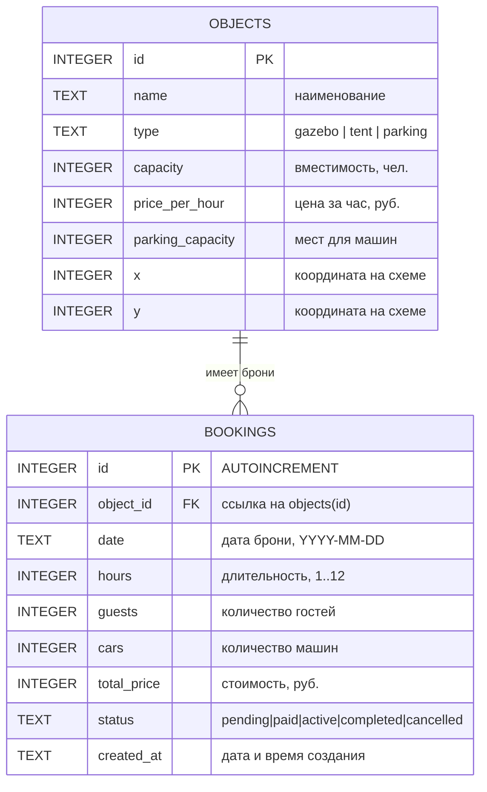

# ER-диаграмма базы данных

**Дата:** 2026-10-09
**Проект:** «Старый Бердск»
**СУБД:** SQLite 3 (better-sqlite3)
**Нормальная форма:** 3НФ

## Диаграмма



## Таблицы

### `objects` — справочник объектов парка

| Поле | Тип | Ограничения | Описание |
|------|-----|-------------|----------|
| `id` | INTEGER | **PK**, автоинкремент не используется — id задаётся сидом | Номер объекта |
| `name` | TEXT | NOT NULL | Наименование: «Беседка №1» |
| `type` | TEXT | NOT NULL, `CHECK (type IN ('gazebo','tent','parking'))` | Тип объекта |
| `capacity` | INTEGER | NOT NULL | Вместимость, человек |
| `price_per_hour` | INTEGER | NOT NULL | Цена за час, рублях |
| `parking_capacity` | INTEGER | NOT NULL | Число мест для машин |
| `x` | INTEGER | NOT NULL | Координата X на SVG-схеме |
| `y` | INTEGER | NOT NULL | Координата Y на SVG-схеме |

### `bookings` — брони

| Поле | Тип | Ограничения | Описание |
|------|-----|-------------|----------|
| `id` | INTEGER | **PK**, AUTOINCREMENT | Номер брони |
| `object_id` | INTEGER | NOT NULL, **FK** → `objects(id)` | Бронируемый объект |
| `date` | TEXT | NOT NULL | Дата в формате `YYYY-MM-DD` |
| `hours` | INTEGER | NOT NULL | Длительность, от 1 до 12 часов |
| `guests` | INTEGER | NOT NULL | Количество гостей |
| `cars` | INTEGER | NOT NULL | Количество машин |
| `total_price` | INTEGER | NOT NULL | Итоговая стоимость, рублях |
| `status` | TEXT | NOT NULL, DEFAULT `'pending'` | Статус брони |
| `created_at` | TEXT | NOT NULL, DEFAULT `datetime('now')` | Дата и время создания |

## Ключи и ограничения

| Элемент | Реализация |
|---------|------------|
| Первичный ключ `objects` | `id INTEGER PRIMARY KEY` |
| Первичный ключ `bookings` | `id INTEGER PRIMARY KEY AUTOINCREMENT` |
| Внешний ключ | `bookings.object_id → objects(id)` |
| Ссылочная целостность | `PRAGMA foreign_keys = ON` при каждом подключении |
| Индекс | `idx_bookings_object_date` на `(object_id, date)` |
| Домен целостности | `CHECK (type IN ('gazebo','tent','parking'))` |

Индекс построен на паре «объект + дата» именно потому, что эта пара —
единственная, по которой выполняется самая частая и самая тяжёлая операция:
проверка занятости слота при создании брони.

## Отношения

| Отношение | Кардинальность | Реализация |
|-----------|-----------------|------------|
| Объект → Бронь | 1 : M | Внешний ключ `bookings.object_id` |

Один объект может иметь много броней (по одной на дату), одна бронь всегда
относится ровно к одному объекту. Удаление объекта не реализовано, поэтому
каскадных правил не требуется.

## Почему в базе нет таблицы пользователей

В системе нет авторизации: посетитель не создаёт учётную запись, а
администратор и директор — это роли экрана, а не записи в базе. Соответственно,
таблицы `users` и `roles` не создаются. Если появится требование авторизации,
структура расширяется таблицей `users` и колонкой `created_by` в `bookings`.

## Почему в базе нет отдельной таблицы цен

Стоимость зависит от сезона, а сезонный коэффициент — это константа
приложения (`1.2` / `1.0` / `0.8`), а не свойство объекта. Выносить её в
таблицу означало бы хранить бизнес-правило в данных и требовать её правки при
смене сезона. Решение о цене сохраняется в `bookings.total_price` — как
снимок на момент брони.

## Проверки целостности на уровне приложения

SQLite не поддерживает составные ограничения `CHECK` по нескольким колонкам,
поэтому часть правил проверяется сервисным слоем:

| Правило | Где проверяется |
|---------|-----------------|
| Часы от 1 до 12 | `bookingService.validateBookingInput` |
| Гости не больше вместимости объекта | там же, с обращением к `objects.capacity` |
| Машины не больше мест парковки | там же, с обращением к `objects.parking_capacity` |
| Дата существует и не в прошлом | `bookingService.validateDate` |
| Горизонт записи 90 дней | там же |
| Один слот — одна бронь | `isSlotAvailable` внутри транзакции |
| Статус из списка | `bookingService.setStatus` |

## Скрипт создания

```sql
PRAGMA foreign_keys = ON;

CREATE TABLE objects (
  id                INTEGER PRIMARY KEY,
  type              TEXT    NOT NULL CHECK (type IN ('gazebo','tent','parking')),
  name              TEXT    NOT NULL,
  capacity          INTEGER NOT NULL,
  price_per_hour    INTEGER NOT NULL,
  parking_capacity  INTEGER NOT NULL,
  x                 INTEGER NOT NULL,
  y                 INTEGER NOT NULL
);

CREATE TABLE bookings (
  id          INTEGER PRIMARY KEY AUTOINCREMENT,
  object_id   INTEGER NOT NULL REFERENCES objects(id),
  date        TEXT    NOT NULL,
  hours       INTEGER NOT NULL,
  guests      INTEGER NOT NULL,
  cars        INTEGER NOT NULL,
  total_price INTEGER NOT NULL,
  status      TEXT    NOT NULL DEFAULT 'pending',
  created_at  TEXT    NOT NULL DEFAULT (datetime('now'))
);

CREATE INDEX idx_bookings_object_date ON bookings (object_id, date);
```

Схема создаётся автоматически при старте (`migrate()` в `src/db.js`), данные
загружаются из `data/objects.json` командой `npm run seed`.