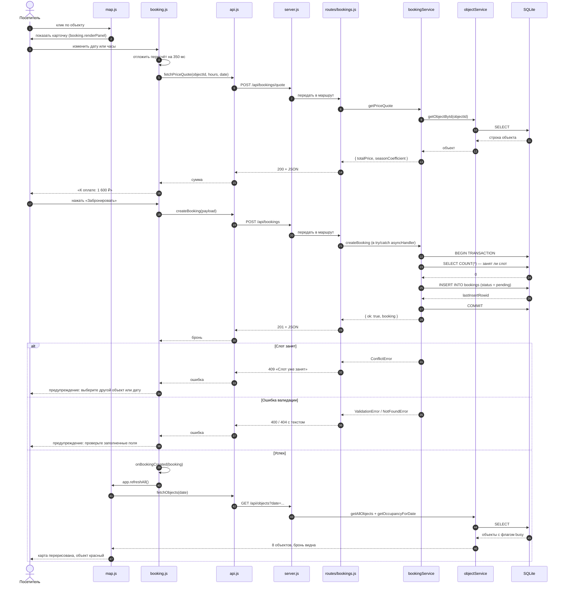
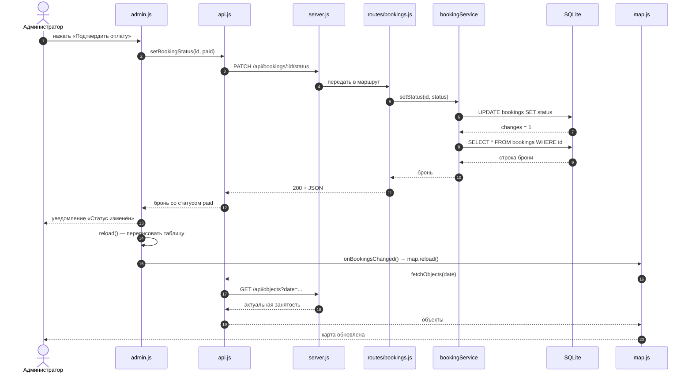

# Диаграмма последовательностей (Sequence Diagram)

**Дата:** 2026-10-09
**Проект:** «Старый Бердск»
**Версия:** 1.0

Показывает порядок взаимодействия модулей при создании брони — тот сценарий,
ради которого в проекте настроены подписки между экранами.

## Создание брони

## Смена статуса администратором

## Ключевая особенность

Обратите внимание на `alt`-ветку в первой диаграмме: **фронтенд не знает,
какой именно код вернёт сервер**. Модуль `booking.js` получает отказ из
`api.js` и передаёт его в показ сообщения, а `map.js` узнаёт об изменении
только через подписку `onBookingCreated`. Прямой связи между экранами нет —
поэтому админку можно переписать, не трогая карту, и наоборот.

Исключение — смена статуса: она порождает событие `onBookingsChanged`, и
`app.js` сам решает обновить карту. Это решение находится в точке входа
приложения, а не внутри экранов.