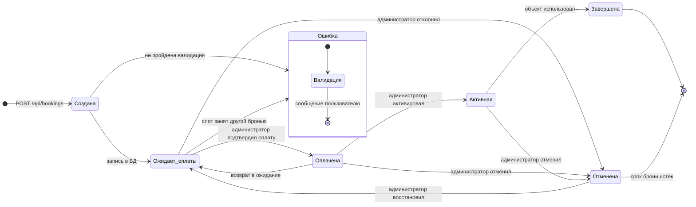

# Диаграмма состояний (State Machine Diagram)

**Дата:** 2026-10-09
**Проект:** «Старый Бердск»
**Версия диаграммы:** 1.1 — добавлено состояние «Ошибка»

Объект наблюдения — **бронь**. Её состояние меняется по мере оплаты и
использования объекта.

## Диаграмма

## Описание состояний

| Состояние | Значение | Слот занят? | Входит в выручку? |
|-----------|----------|-------------|-------------------|
| **Создана** | Транзакция открыта, запись ещё не подтверждена | нет | нет |
| **Ожидает оплаты** | `pending` — бронь зафиксирована, оплата не получена | да | нет |
| **Оплачена** | `paid` — оплата подтверждена администратором | да | **да** |
| **Активная** | `active` — объект используется | да | нет |
| **Завершена** | `completed` — бронирование закончено | нет | нет |
| **Отменена** | `cancelled` — бронь снята | нет | нет |
| **Ошибка** | Валидация не пройдена, запись не создана | — | — |

## Переходы

| Переход | Инициатор | Условие | Что происходит |
|---------|-----------|---------|---------------|
| `[*] → Создана` | Посетитель | Нажата «Забронировать» | Открывается транзакция, считается цена |
| `Создана → Ожидает_оплаты` | Система | Валидация пройдена | `INSERT` со статусом `pending`, транзакция фиксируется |
| `Ожидает_оплаты → Оплачена` | Администратор | Нажато «Подтвердить оплату» | `PATCH /status` |
| `Ожидает_оплаты → Отменена` | Администратор | Нажато «Отклонить» или «Отмена» | `PATCH /status` |
| `Оплачена → Активная` | Администратор | Нажато «Активировать» | `PATCH /status` |
| `Оплачена → Ожидает_оплаты` | Администратор | Нажато «Вернуть в ожидание» | `PATCH /status` |
| `Активная → Завершена` | Администратор | Нажато «Завершить» | `PATCH /status` |
| `→ Отменена` | Администратор | Нажато «Отмена» | `DELETE /bookings/:id` |
| `Отменена → Ожидает_оплаты` | Администратор | Нажато «Восстановить» | `PATCH /status` |
| `→ Ошибка` | Система | Валидация не пройдена или слот занят | Ответ 400/409, **запись не создаётся** |

## Почему состояние «Ошибка» не хранится в базе

Ошибка валидации — это не состояние брони, а отказ операции. Запись в таком
состоянии в базе отсутствует: запрос отклоняется до `INSERT`. Это сознательное
решение в пользу чистой модели данных.

Плюсы такого подхода:

- в справочнике нет мусорных строк, которые пришлось бы потом чистить;
- не нужен статус `error` в `BOOKING_STATUS` и обработка очистки;
- количество броней на дашборде всегда совпадает с реально существующими записями.

Компромисс: состояние «Ошибка» существует только на диаграмме и в
переписывании сообщения пользователю, но не в данных. Для отслеживания
неудачных попыток понадобился бы отдельный журнал.

## Запрещённые переходы

| Попытка | Ответ |
|---------|-------|
| `Завершена → Активная` | 400 «Некорректный статус» — в списке статусов такого значения нет |
| `Завершена → Отменена` | 409 «Завершённую бронь отменить нельзя» — бизнес-правило защищает историю операций |
| Любой переход в неизвестный статус | 400 «Некорректный статус» |

Эти ограничения проверяются автоматическими тестами
(`tests/booking.test.mjs`, `tests/api.test.mjs`).

## Соответствие значениям в коде

| Состояние на диаграмме | Значение в `BOOKING_STATUS` |
|----------------------|---------------------------|
| Ожидает оплаты | `pending` |
| Оплачена | `paid` |
| Активная | `active` |
| Завершена | `completed` |
| Отменена | `cancelled` |

Константы определены в `src/services/bookingStatus.js`, набор допустимых
переходов — в таблице `TRANSITIONS` файла `src/public/admin.js`.