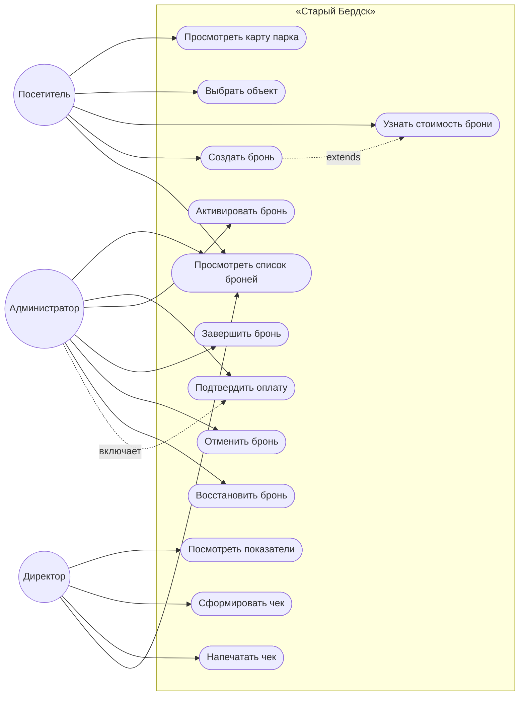

# Диаграмма прецедентов (Use Case)

**Дата:** 2026-10-09
**Проект:** «Старый Бердск»
**Версия диаграммы:** 1.1 — дополнена прецедентами администратора и директора

## Актёры

| Актёр | Описание |
|-------|----------|
| **Посетитель** | Физическое лицо, арендующее объект парка. Авторизация в системе не требуется: идентификация брони происходит по паре «объект + дата». |
| **Администратор** | Сотрудник парка, управляющий бронями: подтверждает оплату, активирует и завершает брони, отменяет их. |
| **Директор** | Руководитель, наблюдающий за финансовым результатом: смотрит выручку и формирует чеки. |

## Диаграмма

## Спецификации прецедентов

### UC-01. Просмотреть карту парка

| Поле | Значение |
|------|----------|
| **Актёр** | Посетитель |
| **Предусловие** | Сервер запущен, база заполнена справочником объектов |
| **Постусловие** | На экране показана схема парка с актуальной занятостью на выбранную дату |
| **Основной сценарий** | 1. Посетитель открывает приложение. 2. Система показывает карту со свободными объектами зелёным, занятыми — красным. 3. Посетитель выбирает дату в фильтре. 4. Система перекрашивает объекты. |
| **Альтернативы** | Сервер недоступен → сообщение с подсказкой, экран остаётся рабочим. Дата не выбрана → показывается занятость на сегодня. |
| **Прецеденты** | — |

### UC-02. Создать бронь

| Поле | Значение |
|------|----------|
| **Актёр** | Посетитель |
| **Предусловие** | Объект выбран на карте, слот свободен |
| **Постусловие** | Бронь со статусом «Ожидает оплаты» сохранена в БД, объект помечен занятым |
| **Основной сценарий** | 1. Посетитель кликает по объекту — открывается карточка. 2. Вводит дату, часы, число гостей и машин. 3. Система показывает стоимость с учётом сезона. 4. Посетитель нажимает «Забронировать». 5. Система проверяет слот и сохраняет бронь. 6. Карта перекрашивается, объект становится красным. |
| **Альтернативы** | Слот занят → сообщение «Объект уже занят». Некорректная дата → сообщение с причиной. Превышена вместимость → сообщение с лимитом. Часов больше 12 → сообщение с границей. |
| **Прецеденты** | UC-03 |

### UC-03. Узнать стоимость брони

| Поле | Значение |
|------|----------|
| **Актёр** | Посетитель |
| **Предусловие** | Выбран объект, указаны дата и часы |
| **Постусловие** | Бронь не создана, стоимость показана |
| **Основной сценарий** | 1. Посетитель меняет дату или часы. 2. Через 350 мс система запрашивает расчёт у сервера. 3. Показывает сумму и сезонный коэффициент. |
| **Альтернативы** | Некорректные часы или дата → в поле выводится текст ошибки. |
| **Прецеденты** | расширяет UC-02 |

### UC-04. Подтвердить оплату

| Поле | Значение |
|------|----------|
| **Актёр** | Администратор |
| **Предусловие** | Существует бронь в статусе «Ожидает оплаты» |
| **Постусловие** | Статус брони — «Оплачено» |
| **Основной сценарий** | 1. Администратор открывает панель, фильтрует по статусу. 2. Нажимает «Подтвердить оплату». 3. Статус меняется, строка перерисовывается, карта обновляется. |
| **Альтернативы** | Бронь уже не в статусе «Ожидает оплаты» → сервер отвечает 409. |
| **Прецеденты** | UC-02 |

### UC-05. Отменить бронь

| Поле | Значение |
|------|----------|
| **Актёр** | Администратор |
| **Предусловие** | Существует незавершённая бронь |
| **Постусловие** | Статус — «Отменена», слот освобождён |
| **Основной сценарий** | 1. Администратор нажимает «Отмена». 2. Слот освобождается и снова доступен для брони. |
| **Альтернативы** | Бронь завершена → 409 «Завершённую бронь отменить нельзя». |
| **Прецеденты** | — |

### UC-06. Сформировать и напечатать чек

| Поле | Значение |
|------|----------|
| **Актёр** | Директор |
| **Предусловие** | Существует оплаченная бронь |
| **Постусловие** | Чек сформирован; при печати в документ попадает только он |
| **Основной сценарий** | 1. Директор открывает дашборд. 2. Нажимает на статус оплаченной брони. 3. Появляется чек с детализацией и итогом. 4. Нажимает «Печать чека», выбирает А4. |
| **Альтернативы** | Бронь не оплачена → кнопка неактивна, подсказка объясняет причину. Бронй нет → заглушка, кнопка печати неактивна. |
| **Прецеденты** | UC-04 |

## Особенности предметной области, отражённые в прецедентах

| Правило | Как отражено |
|---------|--------------|
| Один слот — одна бронь | Альтернативный сценарий UC-02 |
| Горизонт записи 90 дней | Альтернативный сценарий UC-02 |
| Сезонный коэффициент | Отдельный прецедент UC-03, не вшит в UC-02 |
| Завершённую бронь отменить нельзя | Альтернативный сценарий UC-05 |
| Чек только по оплаченной броне | Альтернативный сценарий UC-06 |

## Что не реализовано

- Авторизация и учётные записи. Актёры разделены по экранам, а не по входу в систему.
- Онлайн-оплата: подтверждение оплаты делает администратор вручную.
- Уведомления по электронной почте и в мессенджеры.
- Несколько парков и филиалов.